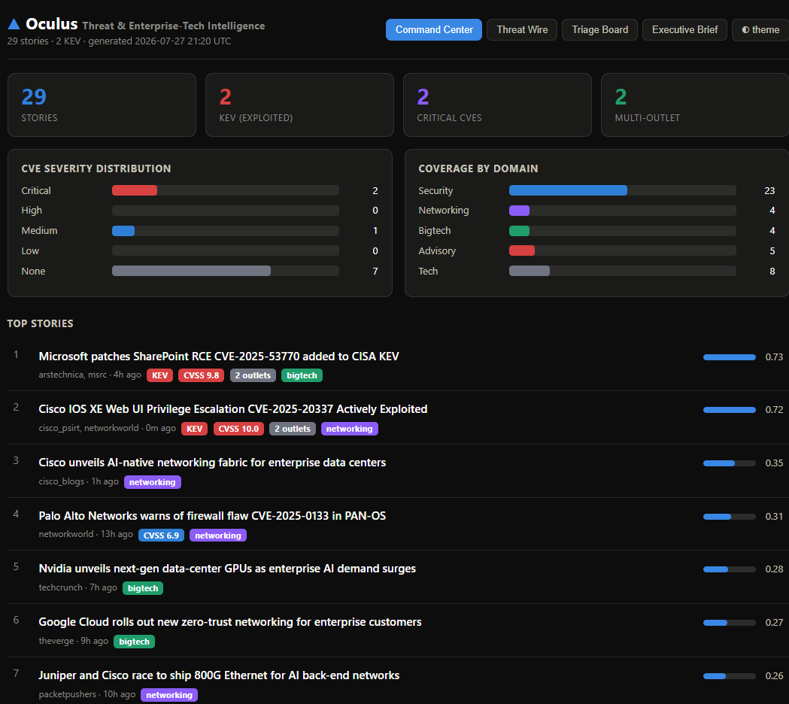
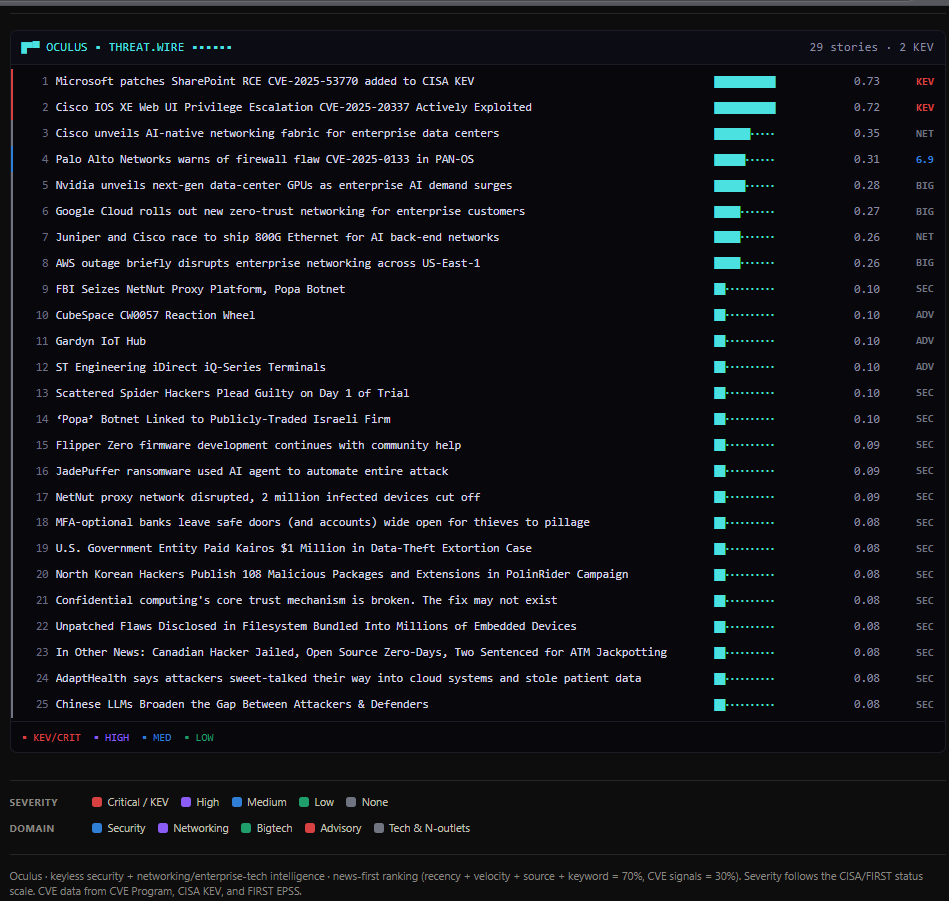
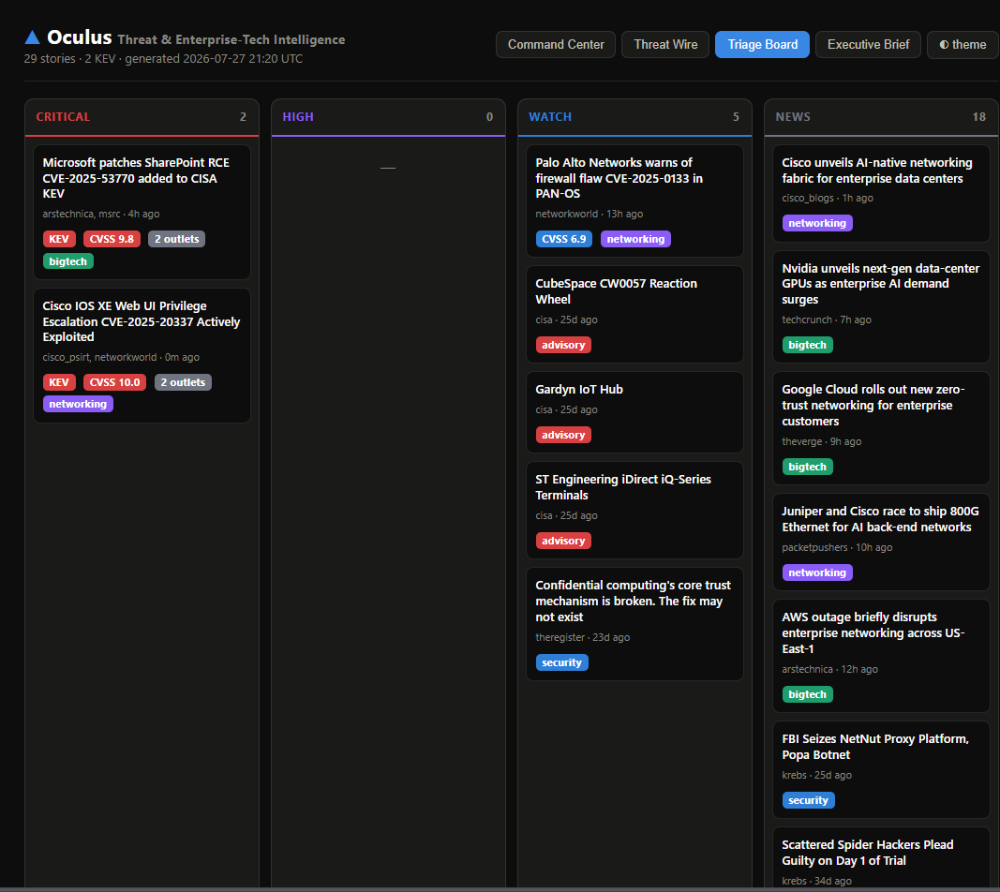
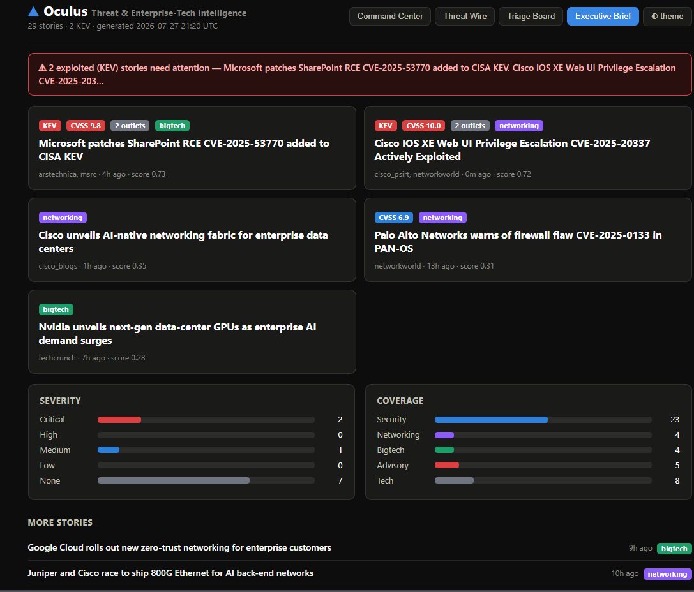

# ▲ Oculus

**Keyless security + networking/enterprise-tech news & CVE intelligence engine.**


Oculus points at a set of RSS/Atom feeds, fetches them politely, clusters the same
story as it appears across outlets, extracts every CVE, enriches each one with
authoritative exploit intelligence (CISA KEV, FIRST EPSS, the CVE Program record),
ranks the whole set by real-world significance, and renders it as an **enhanced
HTML dashboard with charts** — which it can also **email** to you or your customers
and run on a schedule on any **endpoint**.

No API keys required for the core. The CVE data comes from keyless public sources.



---

## Dashboard layouts

Oculus renders one dataset four ways — switch between them live in the browser,
or email the Executive Brief on a schedule. Every chart and chip shares one
five-color system (red / purple / blue / green / grey) for severity and domain.

### Command Center
KPI tiles, a CVE-severity chart, a coverage-by-domain chart, and the ranked
story list with score meters and KEV/CVSS chips.


### Threat Wire
A terminal / SOC-feed view: severity-colored edge bars, sparkbar scores, and
a dense one-line-per-story wire.



### Triage Board
A kanban board that sorts stories by urgency — Critical, High, Watch, News —
so you see what to act on first.



### Executive Brief
A skim-first layout: a KEV alert banner, five hero cards, compact charts, and
a short list. This is also the format emailed on a schedule.



---

## Quick start

```bash
pipx install oculus-intel          # or: pip install oculus-intel
oculus scrape                      # fetch, cluster, enrich, rank
oculus dashboard --open            # build the HTML dashboard and open it
oculus digest --top 15             # quick text digest in the terminal
```

From source:

```bash
git clone <your-repo> oculus && cd oculus
python -m venv .venv && . .venv/bin/activate
pip install -e .
oculus scrape && oculus dashboard --open
```

## Commands

| Command | What it does |
|---|---|
| `oculus scrape` | Fetch every feed, dedup, extract + enrich CVEs, cluster, rank, summarize. |
| `oculus dashboard [-o FILE] [--top N] [--open]` | Render the four-layout HTML dashboard. |
| `oculus digest [--top N]` | Print a ranked text digest. |
| `oculus email` | Email the digest — one per recipient when multi-customer is configured. |
| `oculus watch [--interval M]` | Endpoint daemon: scrape + email on a timer. |
| `oculus sources` | List configured feeds. |

## Email delivery

Create `~/.config/oculus/config.yaml`:

```yaml
email:
  enabled: true
  host: smtp.gmail.com
  port: 587
  use_tls: true
  username: you@example.com
  sender: you@example.com
  recipients: [team@example.com]
  top: 15
watchlist: [cisco, "ios xe", sharepoint, fortinet, palo alto]
retention_days: 14   # rolling window: only show stories from the last N days (0 = keep all)
```

`oculus scrape` is what pulls fresh headlines — loading the dashboard just
re-renders the current store. With `retention_days` set, the dashboard shows only
recent news, so the story count naturally rises and falls day to day as feeds
update. Set it to `0` to keep an ever-growing archive instead.

Put the SMTP password in the environment, not the file:

```bash
export OCULUS_SMTP_PASSWORD='...'
oculus email
```

### Multi-customer delivery

Add a `recipients:` list to `config.yaml` and `oculus email` sends each one a
digest tailored to their domains and watchlist (see `config.example.yaml`):

```yaml
recipients:
  - name: NetworkingTeam
    emails: [neteng@example.com]
    tags: [networking, security]     # only these domains
    watchlist: [cisco, juniper]
    top: 12
```

## AI summaries (built in)

Every scrape writes a one-to-two sentence brief for the top stories, shown on the
dashboard (🤖) and in emails. It uses a local **Ollama** model by default — no API
key — and falls back gracefully if no model is reachable, so a scrape never fails
on AI. Point it at OpenAI or Anthropic instead via `ai.provider` + `OCULUS_AI_KEY`.

```bash
# one-time local model (keyless):
ollama pull qwen2.5:3b
```

## Testing

```bash
pip install -e ".[dev]"
pytest            # 26 offline tests: golden-order ranking, clustering,
                  # CVE parsing (Log4Shell + EPSS traps), dedup, TTL cache, render
```

## Packaging & endpoints

- `pipx install oculus-intel` — the happy path.
- Single-file binary: `pip install ".[build]" && pyinstaller packaging/oculus.spec`.
- Scheduled on an endpoint: `packaging/oculus.service` (systemd),
  `packaging/oculus.cron` (cron), or `packaging/oculus-daily.ps1` +
  Windows Task Scheduler for a daily 7am email (setup steps in that file).

## Running on a customer endpoint

Oculus is a self-contained pip package. On a customer machine:

```bash
pipx install oculus-intel
export OCULUS_SMTP_PASSWORD='...'
oculus watch --interval 60          # scrape + email hourly
```

Or as a background service — see `BUILD_PLAN.md` for a ready-to-use `systemd`
unit and a `cron` line, plus a PyInstaller recipe for a single-file binary.

## Personalize

- **Rename the tool:** change `APP_NAME` / `DISPLAY_NAME` in `oculus/config.py`.
- **Change feeds:** edit `oculus/sources.yaml` (or drop a copy at
  `~/.config/oculus/sources.yaml`). Each entry has a `weight` (0–1) and `tags`.
- **Tune ranking:** every weight lives in `oculus/config.py` (`Weights`). Defaults
  are news-first (recency + velocity + source + keyword = 70%, CVE = 30%).

## How it works

See `ARCHITECTURE.md` for the full pipeline and `BUILD_PLAN.md` for the phased
roadmap. In short: `fetch → parse → normalize → ingest/dedup → CVE extract →
cluster (union-find) → enrich (KEV/EPSS/CVE Program) → rank → summarize → dashboard/email`.

## Roadmap

**Done**
- [x] Keyless ingest → cluster → enrich → rank pipeline
- [x] Four dashboard layouts (Command Center, Threat Wire, Triage, Executive Brief)
- [x] Unified five-color severity/domain palette
- [x] Email delivery (SMTP) + rolling retention window
- [x] TTL cache so repeat scrapes skip freshly-enriched CVEs
- [x] AI summaries — built in, local Ollama by default, fail-soft
- [x] Multi-customer delivery (per-recipient domains & watchlists)
- [x] Dashboard extras: EPSS chips, vendor rollups, interactive filters
- [x] Offline test suite (26 tests) — golden-order ranking, CVE traps, dedup, TTL
- [x] Packaging: `pipx`, PyInstaller spec, systemd + cron recipes

**Next**
- [ ] CI (GitHub Actions running the test suite)
- [ ] EPSS/velocity history for true sparklines over time
- [ ] Publish to PyPI + prebuilt binaries per OS

## License

AGPL-3.0-or-later (matching the upstream project).
